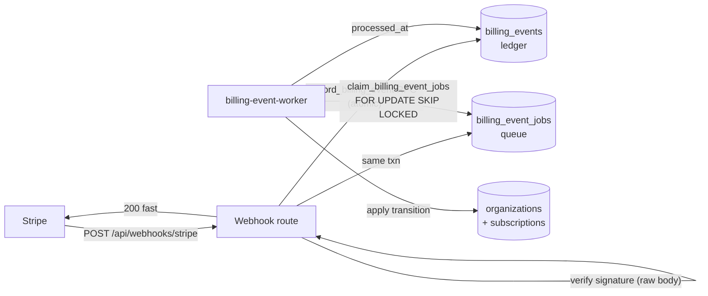

# Billing (Stripe) — Phase 1

The Stripe subscription-billing layer for EmpireVu/Tilotto. **Phase 1 is plumbing
only, in Stripe TEST MODE**: a subscription can be created, upgraded, downgraded,
and canceled against an `organization`, with local state always kept correct. No
customer-facing UI ships here, and gating is **not** yet wired into existing
routes (that is Phase 2).

House tenants (`plan = 'internal'`, the default for every existing org — the A1
brands, boatnames, blairspm) are **exempt from all billing enforcement and
gating** and are untouched by any of this.

---

## ✅ Manual setup checklist

Do these in order. Nothing here is automated — the app never writes prices or
creates the webhook endpoint for you.

### In the Stripe Dashboard (Test mode)

- [ ] Create a **Product + recurring Price** for each plan: `launch`, `operate`,
      `front_desk`. Copy each **Price id** (`price_...`).
- [ ] (Optional) Create a one-time **setup-fee Price** per plan if you charge one.
      Copy those ids too.
- [ ] Create a **Webhook endpoint** → URL `https://<your-app-host>/api/webhooks/stripe`.
      Subscribe at least to: `checkout.session.completed`, `invoice.paid`,
      `invoice.payment_failed`, `customer.subscription.updated`,
      `customer.subscription.deleted`.
- [ ] Copy the endpoint's **Signing secret** (`whsec_...`).
- [ ] Copy your **Secret key** (`sk_test_...`) and **Publishable key** (`pk_test_...`).

### In Supabase

- [ ] Apply the migration `supabase/migrations/20260804120000_add_billing.sql`
      (SQL editor — Railway does not run migrations; see the runbook).
- [ ] (Recommended) Run `supabase/tests/verify-billing.sql` to confirm the schema
      + RLS landed correctly.

### In Railway

Four services deploy from this one repo. Each reads a specific config file, set
per service under **Service Settings → Config-as-Code → "Railway Config File"**. A
service left on the default `railway.json` runs the **web** start command — so set
the path explicitly for every non-web service (this is the same mechanism the
existing workflow worker already relies on).

- [ ] **Web** (`railway.json` → `npm run start`): `STRIPE_SECRET_KEY`,
      `STRIPE_WEBHOOK_SECRET`, `STRIPE_PRICE_*` (+ optional `STRIPE_SETUP_FEE_*`),
      `BILLING_PAST_DUE_GRACE_DAYS`, plus the existing Supabase URL + anon +
      service-role and `APP_BASE_URL`. (`STRIPE_PUBLISHABLE_KEY` is Phase-2/client —
      optional now.)
- [ ] **Billing worker** — new service, config file **`railway.billing-worker.json`**
      (`npm run worker:billing-events`): `NEXT_PUBLIC_SUPABASE_URL` +
      `SUPABASE_SERVICE_ROLE_KEY` + `STRIPE_PRICE_*` (+ optional `BILLING_EVENT_WORKER_*`).
      **No `STRIPE_SECRET_KEY`** — it never constructs a Stripe client.
- [ ] **Reconcile cron** — new service, config file **`railway.billing-reconcile.json`**
      (`npm run job:billing-reconcile`, nightly): `STRIPE_SECRET_KEY` + `STRIPE_PRICE_*`
      + `NEXT_PUBLIC_SUPABASE_URL` + `SUPABASE_SERVICE_ROLE_KEY`. Confirm the cron
      schedule (`0 8 * * *`) in service settings.
- [ ] The existing **workflow worker** (`railway.worker.json`) is **unchanged** and
      needs **no** billing env — do not add Stripe vars to it.

> **Secrets discipline:** `STRIPE_SECRET_KEY` and `STRIPE_WEBHOOK_SECRET` are
> server-only — never give them a `VITE_`/`NEXT_PUBLIC_` prefix, never log them,
> never import them client-side. Only `STRIPE_PUBLISHABLE_KEY` is client-safe.

---

## Environment variables (per service)

Traced from the code, not assumed. Legend: ✅ required · ➕ recommended · ○ optional · — not needed.

| Var | web | billing-worker | reconcile | workflow-worker |
|---|:--:|:--:|:--:|:--:|
| `STRIPE_SECRET_KEY` | ✅ | — | ✅ | — |
| `STRIPE_WEBHOOK_SECRET` | ✅ | — | — | — |
| `STRIPE_PUBLISHABLE_KEY` | ○ (Phase 2) | — | — | — |
| `STRIPE_PRICE_LAUNCH` / `_OPERATE` / `_FRONT_DESK` | ✅ | ✅ | ➕ | — |
| `STRIPE_SETUP_FEE_*` | ○ | — | — | — |
| `BILLING_PAST_DUE_GRACE_DAYS` (def 7) | ○ | — | — | — |
| `BILLING_EVENT_WORKER_ID` / `_BATCH_SIZE` / `_POLL_MS` / `_STALE_AFTER_SECONDS` | — | ○ | — | — |
| `NEXT_PUBLIC_SUPABASE_URL` | ✅ | ✅ | ✅ | ✅ |
| `SUPABASE_SERVICE_ROLE_KEY` | ✅ | ✅ | ✅ | ✅ |
| `NEXT_PUBLIC_SUPABASE_ANON_KEY` (or `_PUBLISHABLE_KEY`) | ✅ | — | — | — |
| `APP_BASE_URL` | ✅ | — | — | — |

Why the non-obvious cells:
- **`STRIPE_SECRET_KEY` is NOT on the billing worker.** The worker
  (`billing-event-worker.ts` → `processBillingEventJob`) only reads the stored
  event payload and writes Postgres; it never imports `billing/stripe.ts`. The
  **reconcile** job *does* (`stripe.subscriptions.list`), so it needs it.
- **`BILLING_PAST_DUE_GRACE_DAYS` is web-only.** Code path:
  `getPastDueGraceDays()` (`billing/env.ts`) → `evaluateOrg` → `orgCan`/`orgLimit`
  (`billing/gating.ts`), whose only caller is the web route
  `GET /api/organizations/[organizationId]/billing`. Neither worker imports gating.
- **`STRIPE_PRICE_*` on the worker** is required for correct upgrade/downgrade
  (mapping the subscription's price id → plan on `customer.subscription.updated`);
  on reconcile it's what enables plan-drift detection.
- **workflow-worker** carries none of the billing vars (its own AI/outbound env is
  unrelated) — don't add Stripe keys to it.

See `.env.example` for the annotated, copy-ready list.

---

## How it works (event flow)

Durable-write-first, then process idempotently off a Postgres queue — the same
philosophy as the lead-intake `raw_leads` log and the `workflow_event_jobs`
queue.



1. **Webhook** (`src/app/api/webhooks/stripe/route.ts`) reads the raw body,
   verifies the `Stripe-Signature` (bad → `400`, no write), then calls the
   `record_billing_event` RPC. That RPC inserts the ledger row
   `on conflict (stripe_event_id) do nothing` **and** enqueues a job **in one
   transaction**. Returns `200` fast (duplicate delivery = no-op, still `200`).
   A durable-write failure → `500` so Stripe retries.
2. **Worker** (`src/server/workers/billing-event-worker.ts`) polls
   `claim_billing_event_jobs`, then `processBillingEventJob`
   (`src/server/services/billing/events.ts`) resolves the org via
   `stripe_customer_id`, applies the transition to `organizations` +
   `subscriptions` idempotently, backfills the ledger's `organization_id`, and
   stamps `processed_at`.
3. **Unresolvable events** (unknown customer) → the job **dead-letters**
   (`status = 'failed'`), the ledger row is **kept** (`processed_at` stays null),
   and it's logged loudly for manual review. Never discarded.

**Idempotency:** dedup on receipt via the unique `stripe_event_id`; transitions
are upserts keyed on `stripe_subscription_id`, so replaying an event yields
identical state.

**Gating** (`src/server/services/billing/gating.ts`): `orgCan` / `orgLimit`.
`internal` → always true/unlimited. Otherwise the subscription must be healthy
(`active`/`trialing`, or `past_due` within `current_period_end + grace`), and a
`feature_flags` row (if any) overrides the plan default. Server-side only.

Plan → feature access lives in one config module:
`src/server/services/billing/config.ts`.

---

## Local development

```bash
# 1. Forward Stripe test-mode events to your local webhook:
stripe listen --forward-to localhost:3000/api/webhooks/stripe
#    -> prints a whsec_... ; put it in .env.local as STRIPE_WEBHOOK_SECRET
```

```bash
# 2. Run the Next API and the billing worker (two terminals):
npm run dev:next
```

```bash
npm run worker:billing-events
```

Trigger events with `stripe trigger <event>` or by completing a test Checkout.

---

## Test-mode end-to-end verification (phase exit criteria)

Use a **non-internal** test org (set its `plan` to something other than
`internal`, or create a fresh org, so gating actually applies). Auth as a member
of that org for the internal routes.

1. **Create** — `POST /api/organizations/{orgId}/billing/checkout` with
   `{ "plan": "launch" }`. Open the returned `url`, pay with test card
   `4242 4242 4242 4242`. Stripe fires `checkout.session.completed` + `invoice.paid`.
   → org `subscription_status = active`, a `subscriptions` row exists, and
   `GET /api/organizations/{orgId}/billing` shows the gating map.
2. **Upgrade / downgrade** — `POST .../billing/portal`, open the portal, switch
   plan. → `customer.subscription.updated` → local `plan` updates.
3. **Fail payment** — `stripe trigger invoice.payment_failed` (or use a failing
   test card). → `subscription_status = past_due`. Paid features stay on until
   `current_period_end + BILLING_PAST_DUE_GRACE_DAYS`, then gate off.
4. **Cancel** — cancel in the portal. → `customer.subscription.deleted` →
   `subscription_status = canceled`, `plan` retained for history, paid features
   gated off.
5. **House-tenant check** — for an `internal` org, `orgCan` returns true for every
   feature and no webhook touches it.
6. **Idempotency** — re-send any event from the Stripe dashboard → duplicate is a
   no-op and state is unchanged.

---

## Applying / rolling back the migration

Migrations are applied **by hand** in the Supabase SQL editor (see
`docs/EMPIREVU_RUNBOOK.md`). For billing:

- **Up:** paste `supabase/migrations/20260804120000_add_billing.sql`.
- **Verify:** run `supabase/tests/verify-billing.sql` (schema + RLS + payload
  column-privilege assertions; RAISEs on any failure).
- **Down:** paste `supabase/rollback/20260804120000_add_billing.down.sql`. This is
  **rollback-only** and is not part of the forward migration set — never apply it
  on a normal deploy.

Clean up/down/up = apply up → down → up again with no errors.

---

## Operational notes

- **Service topology (4 total)**: `web` (`railway.json`) + the pre-existing
  `workflow-event` worker (`railway.worker.json`) + two new services this phase
  adds — the `billing-event` worker (`railway.billing-worker.json`) and the
  reconcile cron (`railway.billing-reconcile.json`). The billing worker is
  deliberately **separate** from the workflow worker so a billing bug can't stall
  workflow jobs (or vice versa), the two carry different credentials (billing
  needs Stripe price ids; the workflow worker needs AI/outbound keys), and they
  scale/restart independently. Both share the same Postgres claim-queue pattern —
  no BullMQ.
- **Dead-letters**: a `billing_event_jobs` row with `status = 'failed'` is the
  dead-letter. Inspect `last_error`; the underlying `billing_events` row is intact,
  so the event can be re-driven after fixing the cause (e.g. linking the customer).
- **Reconciliation**: `npm run job:billing-reconcile` (nightly) lists Stripe
  active/past_due subscriptions and logs any drift vs local state. **Read-only —
  it alerts, it never auto-corrects.** Non-zero exit on mismatch.
- **API version**: pinned to the SDK's `LatestApiVersion`
  (`src/server/services/billing/stripe.ts`); bump it when upgrading `stripe`.
