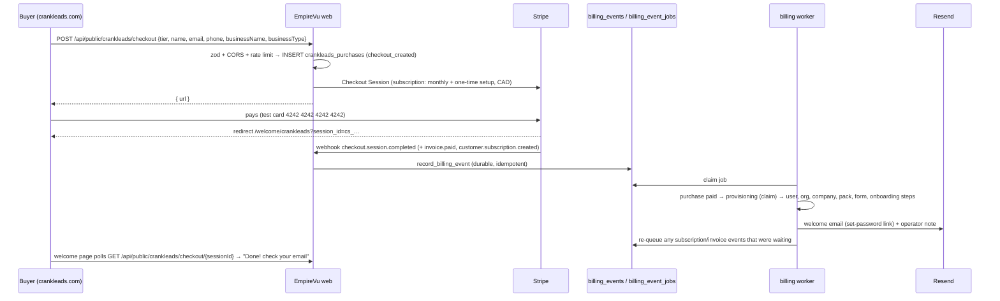

# CrankLeads purchase → automatic EmpireVu account

When a business buys a CrankLeads tier on **crankleads.com**, everything is set up
automatically: they pay first, and on payment EmpireVu creates their login, organization,
company, starter pack, automations and website form, then emails them a set-password link.
They log in to **EmpireVu** (app.empirevu.com) — EmpireVu keeps its own branding; CrankLeads
is only named where the buyer needs context (the welcome email and the welcome page).

The phone number is **not** bought at purchase time: the owner picks it in the setup wizard's
Phone step (Catch / Close: missed-call catcher only; Front Desk: AI receptionist or catcher).
That restriction applies **only** to orgs with `crankleads_tier` `catch`/`close` (and no
`marina_reception` feature-flag override) — enforced in the UI and on
`POST /api/organizations/{id}/onboarding/phone`. Every other org (self-serve trials, existing
operate/launch orgs, house orgs) is unchanged.

| Tier | EmpireVu plan | Stripe (CAD, set by the setup script) | Starter automations |
|---|---|---|---|
| `catch` | `operate` | setup fee + monthly | missed-call text-back, new-lead owner alert, booking reminder, customer-reply forwarding |
| `close` | `operate` | setup fee + monthly | every pack automation except the AI-receptionist ones |
| `front_desk` | `front_desk` (500 AI minutes) | setup fee + monthly | every pack automation |

Catch runs on `operate`, not `launch`, because the missed-call text-back and instant replies
need workflows + SMS. Prices live **only in Stripe** (Working Protocol #4) — code references
them by Price id from env. Mapping: `src/server/services/crankleads/config.ts`.

## Flow



**Status machine** (`crankleads_purchases.status`): `checkout_created → paid → provisioning →
provisioned | failed`. The Checkout Session id is unique, the `provisioning` claim is
status-guarded (optimistic), and every step is idempotent (org found again by its unique
`stripe_customer_id`, company/user/form key re-used), so a session is provisioned **exactly
once** no matter how often Stripe re-delivers or a worker crashes mid-way (a `provisioning`
claim older than 10 minutes is re-claimable).

What provisioning does (`src/server/services/crankleads/provision.ts`), in order:

1. **Login** — Supabase admin `createUser` (email confirmed). If the email already belongs to a
   **confirmed** EmpireVu user (`email_confirmed_at` set), the new org is attached to them (their
   default org is NOT changed) and they get a "log in" email (no password link). If it belongs
   to an **unconfirmed** user (a squatted signup), the account is reclaimed for the payer:
   password scrambled, email confirmed, banned → unbanned to revoke its sessions, and the payer
   gets the set-password link.
2. **Organization** — `createOrganization` (the signup service) with the tier's plan,
   `subscription_status = active`, the Stripe customer, `crankleads_tier`; owner membership.
3. **Company** — `createCompany` (the wizard's Business-step service — installs the recipe
   catalog), then owner email, E.164 owner phone, timezone `America/Toronto`.
4. **Industry pack** for the business type (Property maintenance & snow → `property-maintenance-snow`,
   Landscaping → `landscaping`, Roofing → `roofing`, HVAC & plumbing → `hvac-plumbing`,
   Contracting & renovation → `general-contractor`, Marine → `marine`; Auto detailing,
   Cleaning, Other → no pack) via `applyIndustryPack`, with the tier's automations.
5. **Website form key** (`public_form_keys`) — the hosted link `/f/evpk_…` works immediately.
6. **Onboarding** — `business` (and `services` when a pack applied) marked complete, so
   `/onboarding` resumes at the right step. Left for the owner: prices, phone, website snippet + test.
7. **Emails** — buyer: *"Your CrankLeads system is ready — finish setup (10 min)"* with what's
   done, the set-password link, the hosted form link and the 3 remaining steps. Operator
   (`OWNER_EMAIL`): *"New CrankLeads purchase: <business> (<tier>)"*. An email failure never
   fails provisioning — it's recorded (`welcome_email_error`) and flagged in the operator note.

**Set-password link.** The admin `generateLink({type: "recovery"})` hashed token is sent as
`/update-password?token_hash=…&type=recovery&next=/onboarding?step=resume`; the page verifies it with
`verifyOtp` (the SPA's Supabase client uses PKCE, so the raw `action_link` — an implicit-flow
redirect — would be rejected). The link is one-time and expires with the project's email OTP
expiry (Supabase default 1 hour — raise it to 24 h in Auth settings if you like); the buyer can
always use **Forgot password** or the welcome page's **Resend** button.

**Events that race ahead.** `invoice.paid` / `customer.subscription.created|updated` can be
processed before provisioning finishes. When their customer is unknown **and** a CrankLeads
purchase for it (by `metadata.purchaseId` or customer id) is still `checkout_created / paid /
provisioning`, the job is re-queued with backoff (30 s, 60 s, 120 s, 240 s; bounded by
`max_attempts = 5`) instead of dead-lettering. When provisioning finishes it pulls those jobs
forward (and re-queues any that already dead-lettered), so they resolve to the new org. Unknown
non-CrankLeads customers still dead-letter exactly as before.

**Failures.** ANY error in the CrankLeads branch (purchase lookup/rebuild, marking it paid, the
claim, a provisioning step, even recording the failure) is retried by the queue while attempts
remain (the purchase is marked `failed` with `last_error` when a step failed); on the last
attempt the operator gets *"ACTION NEEDED: CrankLeads provisioning failed"* whatever state the
purchase is in, and the job dead-letters. The payment and the purchase row are never lost.

**Paid = `paid` or `no_payment_required`** (e.g. a 100%-off coupon); `unpaid` waits for
`checkout.session.async_payment_succeeded`.

**Safety-net sweep** (`npm run job:crankleads-provision -- --stuck`, Railway cron every 15 min —
`railway.crankleads-sweep.json`): every purchase still `checkout_created / paid / provisioning`
whose row hasn't changed for 15 minutes (`--older-than-minutes N`) and was created in the last
26 h: `paid` / stuck `provisioning` → provisioned now; `checkout_created` → asks Stripe and
provisions if the session is paid (a missed webhook), otherwise leaves it (abandoned/expired).
Each is a final attempt, so a failure alerts the operator. Exit code 1 if anything failed.

## API

### `POST /api/public/crankleads/checkout` (public, CORS)

Request (JSON, ≤ 8 KB):

```json
{
  "tier": "catch | close | front_desk",
  "name": "Jane Roofer",
  "email": "jane@example.com",
  "phone": "(705) 555-0101",
  "businessName": "Jane's Roofing",
  "businessType": "Roofing",
  "founding": true,
  "utm": { "utm_source": "google" }
}
```

`founding` and `utm` are optional. `phone` needs ≥ 10 digits. `businessType` is free text
(≤ 100 chars) — the site's options map to packs as listed above; anything else is generic.

| Status | Body |
|---|---|
| 200 | `{ "url": "https://checkout.stripe.com/…" }` — redirect the browser there |
| 400 | `{ "error": "Please check the highlighted fields.", "fields": { "email": "Invalid email" } }` (or `{ "error": "Invalid JSON." }`) |
| 403 | `{ "error": "Origin not allowed." }` — browser Origin not in `CRANKLEADS_SITE_ORIGINS` |
| 413 | `{ "error": "Request too large." }` |
| 429 | `{ "error": "Too many requests…" }` — 10 / 10 min per IP, 5 / hour per email |
| 503 | `{ "error": "Checkout is temporarily unavailable…" }` — the tier's Stripe prices aren't configured |
| 502 | `{ "error": "Couldn't start checkout. Please try again." }` — Stripe error |

CORS: `Access-Control-Allow-Origin` echoes an allow-listed origin only; no credentials. The
site calls this straight from the browser (no server needed). A request with **no** Origin (a
server-side call) is also allowed — the endpoint only ever opens a Checkout Session, so that is
not an escalation; the rate limits apply either way.

Checkout Session: `mode: subscription`, line items = tier monthly price + tier setup price
(one-time prices ride on the first invoice only), `customer_email`, `client_reference_id` =
purchase id, `currency: cad`, `billing_address_collection: required`, `automatic_tax` off unless
`STRIPE_AUTOMATIC_TAX=true`, `discounts: [{coupon}]` when `founding` and
`STRIPE_COUPON_CL_FOUNDING` is set **and still valid in Stripe** (an exhausted/expired/missing
coupon — or a create that rejects it — falls back to full price instead of failing the sale),
`allow_promotion_codes: false` (no other promo code can be applied), `metadata` and
`subscription_data.metadata` = `{source: "crankleads", purchaseId, tier, plan, businessName,
businessType, ownerName, ownerPhone, utm}` (utm JSON kept ≤ 500 chars),
`success_url = APP_BASE_URL/welcome/crankleads?session_id={CHECKOUT_SESSION_ID}`,
`cancel_url = CRANKLEADS_CANCEL_URL` (default `https://crankleads.com/#pricing`).

**Example (crankleads.com):**

```js
const res = await fetch("https://app.empirevu.com/api/public/crankleads/checkout", {
  method: "POST",
  headers: { "Content-Type": "application/json" },
  body: JSON.stringify({ tier, name, email, phone, businessName, businessType, founding, utm }),
});
const body = await res.json();
if (res.ok) window.location.href = body.url; else showErrors(body.fields ?? body.error);
```

### `GET /api/public/crankleads/checkout/{sessionId}` (public, same-origin)

`{ "data": { "status": "pending | provisioning | ready | failed", "businessName": "…", "emailMasked": "j***@example.com" } }`
— nothing else. 404 for an unknown or malformed id.

### `POST /api/public/crankleads/checkout/{sessionId}/resend`

Re-sends the welcome email (fresh set-password link) to the address that paid — never to an
address in the request. 3 / hour per session, 10 / hour per IP. 409 until provisioned, and 409
"use Forgot password" once the owner has signed in or 7 days after setup (a set-password link
is a credential; this public endpoint stops minting them).

## Setup checklist (Stripe TEST mode first)

1. **Apply the migration** in the Supabase SQL editor:
   `supabase/migrations/20261003120000_crankleads_purchase.sql`
   (verify: `select count(*) from crankleads_purchases;` → `0`).
2. **Create the Stripe catalog** (PowerShell, test key). Amounts are in **cents**:
   ```powershell
   $env:STRIPE_SECRET_KEY = "sk_test_..."
   npm run stripe:setup-crankleads -- --catch-setup 150000 --catch-monthly 50000 --close-setup 250000 --close-monthly 100000 --front-desk-setup 350000 --front-desk-monthly 150000 --founding-percent 50 --founding-max 5
   ```
   Add `--dry-run` first to see what it would create. It is idempotent (products by id
   `crankleads_<tier>` / `crankleads_<tier>_setup`, prices by lookup key
   `crankleads_<tier>_monthly` / `crankleads_<tier>_setup`, coupon `crankleads_founding_<percent>`),
   refuses a live key unless `--live`, and prints the env lines. Changing an amount later needs
   `--replace` (Stripe prices are immutable; the lookup key moves to the new price).
   Setup fees sit on their own `…_setup` products so the founding coupon (`duration: once`,
   `applies_to` the three setup products) discounts **only the setup fee**.
3. **Paste the env** the script prints into Railway:
   - **[web]**: `STRIPE_PRICE_CL_*`, `STRIPE_SETUP_FEE_CL_*`, optional `STRIPE_COUPON_CL_FOUNDING`,
     optional `CRANKLEADS_SITE_ORIGINS`, `CRANKLEADS_CANCEL_URL`, `STRIPE_AUTOMATIC_TAX`.
   - **[billing-worker]**: `STRIPE_PRICE_CL_*` **plus** (existing values, same as web)
     `APP_BASE_URL`, `RESEND_API_KEY`, `OUTBOUND_FROM_EMAIL` (opt. `OUTBOUND_REPLY_TO`),
     `OWNER_EMAIL`, and `TWILIO_ACCOUNT_SID` / `TWILIO_AUTH_TOKEN` / `TWILIO_FROM_NUMBER` (only so
     the SMS starter automations install **active** — the worker never sends SMS).
   - **[reconcile]**: `STRIPE_PRICE_CL_*` (plan-drift check).
   - **[crankleads-sweep]** — new Railway **cron** service, config file
     `railway.crankleads-sweep.json` (`npm run job:crankleads-provision -- --stuck`, `*/15 * * * *`):
     `NEXT_PUBLIC_SUPABASE_URL`, `SUPABASE_SERVICE_ROLE_KEY`, `STRIPE_SECRET_KEY`, `APP_BASE_URL`,
     `RESEND_API_KEY`, `OUTBOUND_FROM_EMAIL`, `OWNER_EMAIL`, `TWILIO_*` (same values as web).
4. **Stripe webhook** (Dashboard → Developers → Webhooks → the `/api/webhooks/stripe` endpoint):
   make sure it sends `checkout.session.completed`, `checkout.session.async_payment_succeeded`,
   `invoice.paid`, `invoice.payment_failed`, `customer.subscription.created`,
   `customer.subscription.updated`, `customer.subscription.deleted`.
5. **Deploy** web + billing worker (the billing worker now does the provisioning).
6. **HST**: automatic tax is OFF. Either register for Stripe Tax (Ontario HST) and set
   `STRIPE_AUTOMATIC_TAX=true` on [web] (prices are created `tax_behavior: exclusive`, so HST is
   added on top), or invoice HST manually.

## End-to-end test (test card)

1. From crankleads.com (or PowerShell):
   ```powershell
   $body = @{ tier = "catch"; name = "Test Owner"; email = "you+cl1@yourdomain.com"; phone = "705 555 0101"; businessName = "Test Roofing"; businessType = "Roofing" } | ConvertTo-Json
   Invoke-RestMethod -Method Post -Uri "https://app.empirevu.com/api/public/crankleads/checkout" -ContentType "application/json" -Body $body
   ```
   Open the returned `url`.
2. Pay with **4242 4242 4242 4242**, any future expiry, any CVC, any Canadian postal code.
3. You land on `/welcome/crankleads?session_id=cs_test_…`: "Payment received — setting up your
   system…" then "Done! Check your email (y***@yourdomain.com)…" within a few seconds (billing
   worker poll interval).
4. The email *"Your CrankLeads system is ready — finish setup (10 min)"* arrives; the operator
   inbox gets *"New CrankLeads purchase: Test Roofing (Catch)"*.
5. Click **Set your password and log in to EmpireVu** → set a password → **Continue setup** →
   `/onboarding` resumes at **Phone** (Business + Services done). The Phone step offers only the
   missed-call catcher (Catch).
6. Check: Settings → Billing shows plan `operate`, status active; `organizations.crankleads_tier = 'catch'`;
   Settings → Industry pack shows Roofing; the hosted form link from the email opens.
7. Repeat with `front_desk` to see the AI receptionist offered on the Phone step.

## Re-running a failed provision

```powershell
npm run job:crankleads-provision -- --session cs_test_...
```

Run it from a machine with the production env (Supabase service role, Resend, `APP_BASE_URL`,
`OWNER_EMAIL`; plus `STRIPE_SECRET_KEY` if the purchase never got its webhook). It:
- provisions a `failed` / `paid` / stuck `provisioning` purchase (as the final attempt),
- for a `checkout_created` purchase (webhook never arrived) asks Stripe whether the session is
  paid and provisions it if so,
- for an already `provisioned` purchase just re-queues any billing events still waiting on it.

Find failed purchases: `select stripe_checkout_session_id, business_name, last_error from crankleads_purchases where status = 'failed';`

## Data

Migration `20261003120000_crankleads_purchase.sql` (rollback
`supabase/rollback/20261003120000_crankleads_purchase.down.sql`):

- `organizations.crankleads_tier` (`catch | close | front_desk`, nullable) — what the org
  bought; kept in step with portal tier changes by `customer.subscription.updated`.
- `crankleads_purchases` — staging + state machine. **Tenancy exception:** it is written before
  any organization exists, so `organization_id` is nullable (filled by provisioning). RLS is on
  with **no policies** and no grants to `anon`/`authenticated`: service role only.

## Stripe Managed Payments

The live account has **Managed Payments** (Stripe as merchant of record) on by default. It
only supports digital products, rejects `automatic_tax`, and takes over invoicing and receipts.
CrankLeads includes a done-for-you setup service and EmpireVu runs its own billing, so every
CrankLeads Checkout Session sends `managed_payments: { enabled: false }`. To collect HST, turn on
Stripe Tax in the Dashboard (register Ontario/Canada, set product tax codes) and set
`STRIPE_AUTOMATIC_TAX=true` on [web].

## Checkout branding

CrankLeads sells through the EmpireVu Stripe account, so by default Stripe Checkout would show
EmpireVu's name and logo. Every CrankLeads session sets `branding_settings` (display name
"CrankLeads", the wordmark logo hosted at `https://crankleads.com/brand/crankleads-logo.png`
from the crankleads-system repo's `public/brand/`, dark background, lime button, Inter). Only
EmpireVu's own plan checkouts keep the account branding.

Override with `CRANKLEADS_CHECKOUT_DISPLAY_NAME`, `CRANKLEADS_CHECKOUT_LOGO_URL` (https only),
`CRANKLEADS_CHECKOUT_BACKGROUND_COLOR` / `CRANKLEADS_CHECKOUT_BUTTON_COLOR` (`#rrggbb` only)
on the web service; invalid values fall back to the defaults.

What per-session branding can't change: the account's **business name** still appears in
Stripe's terms text, the emailed receipt, the customer portal, and the card **statement
descriptor**. To make those say CrankLeads too, either set Stripe → Settings → Business →
Public details (affects EmpireVu customers as well) or sell CrankLeads from its own Stripe
account.


## Welcome page branding

`/welcome/crankleads` shows the CrankLeads logo, tab title ("Welcome — CrankLeads") and tab
icon (`public/brand/crankleads-logo.svg`, `public/brand/crankleads-favicon.svg` — copies of the
crankleads.com artwork). The icon/title swap is undone when the buyer leaves the page, so the
app they log into stays EmpireVu.

## Setup follow-ups (automatic chasing until the buyer is live)

A buyer who pays and never finishes setup is chased automatically — nobody has to do it by
hand. Code: `src/server/services/crankleads/setup-checklist.ts` (checklist),
`followup-schedule.ts` (pure timing), `followup-messages.ts` (pure templates),
`setup-followups.ts` (the pass). Tests: `src/test/crankleads-setup-followups.test.ts`.

### The setup checklist (one function, reused everywhere)

```ts
// pure core
computeSetupChecklist({ organizationId, companyId, tier, facts, appBaseUrl }): SetupChecklist
// loader (RLS client or the worker's service-role client; every query filtered by org + company)
loadSetupChecklist(ctx: TenantServiceContext, { companyId?, tier?, appBaseUrl? }): Promise<SetupChecklist | null>
loadSetupFacts(ctx, companyId): Promise<SetupFacts>
// SetupChecklist = { organizationId, companyId, tier, phonePath, steps[], doneCount, totalCount, isLive, nextStep }
// step = { key, title, action, done, wizardStep, path: "/onboarding?step=…&org=…", deepLink }
```

Required steps per tier, in wizard order (judged from **real state**, never from the wizard's
"Skip / mark done" buttons):

| Step | Done when | catch | close | front_desk (AI) | front_desk (catcher chosen) |
|---|---|---|---|---|---|
| `services` — Add your prices | ≥ 1 catalog item has a price | ✓ | ✓ | ✓ | ✓ |
| `phone` — missed-call / AI number | an active `missed_call_catcher` (or, AI path, `ai_receptionist`) `voice_numbers` row | ✓ | ✓ | ✓ | ✓ |
| `forwarding` — Turn on call forwarding | the active catcher number's **`voice_numbers.forwarding_verified_at` is not null** (set by feat/forwarding-verify when a test's forwarded leg arrives, a real forwarded missed call arrives, or — at deploy — backfilled for catcher numbers that already caught calls; cleared only by a `not_forwarded` test) | ✓ | ✓ | – | ✓ |
| `test_call` — Make a test call | a `retell_calls` row for the company | – | – | ✓ | – |
| `payments` — Connect payments | `companies.stripe_charges_enabled` | – | ✓ | ✓ | ✓ |
| `website` — Add your website form | an active `public_form_keys` (or `intake_keys`) row has `last_used_at` (a test or real lead came through) | ✓ | ✓ | ✓ | ✓ |
| `automations` — missed-call text-back | an **active** `missed-call-text-back` workflow | ✓ | ✓ | – | ✓ |

Why: Catch sells the missed-call text-back (no money moves); Close and Front Desk starter packs
include the quote/deposit automations, which need Stripe Connect. Team invites are never
required. A Front Desk buyer with no number yet is assumed to be on the AI path; if they pick
the catcher instead (catcher number, no AI number) they get the catcher steps.

`isLive` = every required step done. **`crankleads_purchases.live_at`** is stamped (once, never
cleared) by the follow-up pass the first time the checklist reports live — the purchase row is
the per-buyer record of the sale, next to `paid_at` / `provisioned_at`.

### Schedule

Runs inside the **existing workflow-event worker** (`runScheduler`, throttled to every 5 min) —
no new Railway service. For each `provisioned` purchase that isn't live (≤ 90 days old):

| Stage | When (company timezone, `companies.timezone`) | Channels |
|---|---|---|
| `day1` | 1st business day after provisioning | email + SMS to the owner |
| `day3` | 3rd business day | email + SMS |
| `day5` | 5th business day | email + SMS |
| `day10` | 10th business day | email + SMS **+ operator note to `OWNER_EMAIL`** ("buyer stuck") |
| `live` | when the checklist first reports live (≤ 3 days after) | one "🎉 You're live" email + SMS |

- Reminders only on **weekdays 09:00–18:00 local** (provisioned Friday → day 1 is Monday);
  the live confirmation any day 08:00–21:00 local (it answers the owner's own action).
- Several stages due at once (worker was down) → only the **latest** is sent.
- **At most one reminder per purchase per local day**; each stage at most once.
- **Idempotent**: `crankleads_setup_followups` has `unique (purchase_id, stage)` and a partial
  unique `(purchase_id, local_date)` for reminders; the row is inserted (claimed) **before**
  sending, so retries / two workers / double runs can't double-send. A failed send is recorded
  (`email_status` / `sms_status`) and not retried.
- **Stops** immediately when live, when `organizations.subscription_status = 'canceled'`, when
  the owner clicks the email's "stop these reminders" link, and after day 10 / 30 days.
- **Existing buyers are never spammed on deploy:** the migration stamps
  `crankleads_purchases.setup_followups_exempt_at` on every purchase that was already
  `provisioned` when it ran (only in the run that adds the column — re-running it exempts no
  one new). Exempt purchases get **no reminders and no "you're live" message**; the pass still
  stamps `live_at` silently when their checklist reports live. Kept separate from
  `setup_reminders_stopped_at` (that one means "the owner opted out" — operator health shows it).
  To opt an old buyer back in: `update crankleads_purchases set setup_followups_exempt_at = null
  where id = '…';`.

### Messages

CrankLeads-branded (sender name `CrankLeads`), short and specific — every reminder names the
unfinished steps and links straight to the next one, e.g. SMS:

> CrankLeads: Hi Jane, 2 steps left to get Jane's Roofing live: set call forwarding (dial
> \*\*004\*+17055550000# from your business phone) and add your website form and send a test
> lead. https://app…/onboarding?step=phone&org=…
> Reply STOP to stop these texts.

- **Deep link** `APP_BASE_URL/onboarding?step=<wizard step>&org=<orgId>`: the wizard opens on
  that step for that org (also for accounts that already have an org). Signed out → sign-in,
  then straight back to the step.
- **Owner never signed in** (new user, no `last_sign_in_at`): the email also carries a fresh
  one-time set-password link (`createSetPasswordUrl(admin, email, next)` — same token_hash
  approach as the welcome email) whose `next` is the step. That link signs in **as the buyer**,
  so an email carrying it is sent **only to `crankleads_purchases.owner_email`** (the checkout
  email the account was created for) — never to the resolved owner contact (which can be a
  different company email, an org admin, or the platform `OWNER_EMAIL` for house orgs). SMS
  never carries a login token (it has the plain deep link) and still goes to the resolved
  owner phone.
- Owner address: `companies.owner_email` / `owner_phone_e164` (`resolveOwnerContacts`), falling
  back to the purchase's email / phone (except the set-password email above → buyer only). Sent through `deliverMessage` (message_log + usage
  metering); SMS goes **from `TWILIO_FROM_NUMBER`** (`smsFrom: "platform"`), so a STOP reply
  only stops platform texts — never the company's own catcher number's lead alerts.
- Opt-out: SMS "Reply STOP" (Twilio carrier-level opt-out); email footer link
  `/api/public/crankleads/setup-reminders?token=…` (48-hex random token per purchase; GET shows
  a confirm button, POST sets `setup_reminders_stopped_at`). Transactional messages to the
  account owner — no marketing consent needed (docs/messaging-compliance.md).

### Dashboard card

CrankLeads orgs see **"Setup: 3 of 5 done"** on the dashboard with the steps and a button to the
next one (`GET /api/organizations/{orgId}/setup-checklist`, normal RLS auth; `data: null` for
non-CrankLeads orgs). Hidden once live.

### Data

Migration `20261004130000_setup_followups.sql` (rollback
`supabase/rollback/20261004130000_setup_followups.down.sql`) — apply **after**
`20261004120000` (feat/forwarding-verify, which adds `voice_numbers.forwarding_verified_at`):

- `crankleads_purchases.live_at`, `setup_reminders_stopped_at`, `setup_reminders_stop_token`
  (+ unique partial index on the token, partial index on not-live provisioned purchases), and
  `setup_followups_exempt_at` — **backfilled** to `now()` for purchases already provisioned when
  the migration runs (see "Existing buyers" above).
- `crankleads_setup_followups` — send log / idempotency guard (org + company tenancy, RLS on,
  members select, writes service-role only).

Handy queries:

```sql
-- who is stuck
select business_name, tier, provisioned_at from crankleads_purchases
 where status = 'provisioned' and live_at is null order by provisioned_at;
-- what was sent
select p.business_name, f.stage, f.local_date, f.next_step, f.email_status, f.sms_status, f.operator_status
  from crankleads_setup_followups f join crankleads_purchases p on p.id = f.purchase_id
 order by f.created_at desc limit 50;
```

Env: none new. The **[worker]** needs (existing values) `APP_BASE_URL`, `RESEND_API_KEY`,
`OUTBOUND_FROM_EMAIL`, `TWILIO_ACCOUNT_SID` / `TWILIO_AUTH_TOKEN` / `TWILIO_FROM_NUMBER` and
`OWNER_EMAIL`.

## "I didn't get the welcome email"

The billing worker logs `welcome email accepted for purchase <id> → m***@… (resend id …)` once
Resend accepts it (a rejection logs `WELCOME EMAIL FAILED` and stores `welcome_email_error`).
Look the id up in Resend → Emails to see delivered / bounced / suppressed. The buyer can also
press **Resend the email** on the welcome page, or use "Forgot password" on sign-in.
